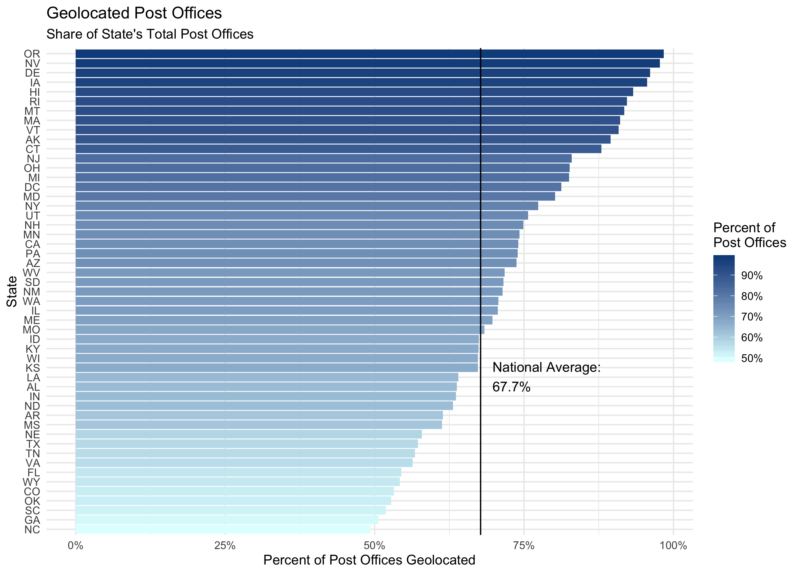

# US Post Offices: A Data Biography

## Cameron Blevins

#### Overview

`US Post Offices` is a spatial-historical dataset containing records of post offices that operated in the United States from the 1700s to the 1900s. Much of the data about these offices (including their names and dates of operation) was collected by postal historian and philatelist Richard Helbock, while Cameron Blevins geocoded the records. You can use this data to map the US Post on a year-by-year basis:

[animation]

Following the examples of Heather Krause's ["data biographies"](https://weallcount.com/2019/01/21/an-introduction-to-the-data-biography/) and Timnit Gebru et. al.'s ["Datasheets for Datasets"](https://arxiv.org/abs/1803.09010), the following offers detailed documentation for `US Post Offices`.	

#### Origins

Richard Helbock (1938-1911) was a noted postal historian and philatelist who spent decades researching the history of the US postal system. A geography professor, Helbock was a leader in the philatelic community, including founding the journal *LaPosta: A Journal of American Postal History* in 1969. In the late 1990s and early 2000s, Helbock published *United States Post Offices*, "the first attempt to publish a complete listing of all the United States post offices which have ever operated in the nation." This was a series of eight volumes containing historical information about every post office that operated in different regions of the United States, including their name, county, state, and years of operation. Helbock made these volumes primarily for stamp collectors, who could use these records was to help determine the scarcity (and therefore approximate value) of a stamp that originated from a particular post office at a particular time.

In addition to the printed volumes, Helbock created a dataset of these records that he made available for purchase. After he passed away in 2011, his wife Cath Clark continued to sell these CD's online. In 2013, Cameron Blevins purchased the CD from Cath Clark while he was a PhD student at Stanford working on his dissertation. Unlike Helbock, the main goal of Blevins's work was to create a spatial-historical dataset that he could use to analyze the history of the western postal system in the late 1800s. He used this data first for his dissertation and then for his book, [*Paper Trails: The US Post and the Making of the American West*](https://global.oup.com/academic/product/paper-trails-9780190053673). Blevins used a process of geocoding to try and assign coordinates to as many post offices as possible (described in more detail in ______.) `US Post Offices` is the result of Helbock's archival research and Blevins's data processing.

#### What's in the dataset?

`US Post Offices` contains 166,140 records of post offices that operated in the United States. Each individual record represents information about a single post office, including its name, location, and approximate dates of operation. It includes post offices that operated within fifty US states, but does not include post offices that operated in colonial territories that did not become states (ex. Puerto Rico). The earliest post office in the dataset opened in 1639 and the most recent new post office opened in 2000.

<!------>

#### How was the dataset made?

The process behind `US Post Offices` can be broken into two stages, the first done by Richard Helbock and the second by Cameron Blevins. 

***Stage 1: Richard Helbock***

Richard Helbock created a dataset of post offices by drawing upon the US Post Office Department's *Records of Appointments of Postmasters*, in which the Department recorded information about postmaster appointments at the nation's post offices. Helbock also consulted other kinds of sources, including post offices made by other philatelists and postal historians. The major challenge he faced in compiling his dataset was to decide what, exactly, constituted a single record for an individual "independent post office." As he noted, what should he do if a post office changed names from "Hillsborough" to "Hillsboro"? Should he leave this as a single post office with the new name, or create two separate records? What if that post office changed locations, or closed for a few years and then re-opened? Helbock helpfully provided documentation about the decisions he made when collecting and recording information in the introductions to his eight volumes. Many of these decisions revolved around the nature of historical post offices prior to the early 20th century, when they were much more fluid entities than they are today. 

- **General approach:** 
  - Helbock: "The overall rule of thumb applied to the listing of post office names was “Keep it Simple.” In other words, if the choice came down to making a double listing or a single listing for a particular post office with a minor name change due to spelling differences, the single listing was chosen. There are, however, many exceptions to this rule."
- **Closings and Re-Openings:** 
  - **Caveat**: 21,040 post offices (12.7% of the total) were were NOT in continuous operation between their established and discontinued years. For any given year, there is a small chance that they were actually temporarily closed.
  - Unlike today's post offices, it was common for pre-20th century post offices to temporarily shut down their operations before re-opening months or even years later. This process could happen multiple times for the same post office. Rather than making a new post office record, Helbock decided to use a 10-year cutoff: if the post office was closed for *less than 10 years* before re-opening, he kept it under the same record. If it remained closed for *10 years or more* before re-opening, he treated it as two separate post offices and created a second record for the "new" post office.
  - Helbock did not record detailed information about all of these closings and re-openings. Instead, he summarized this in a column in his dataset that was a simple binary of whether or not the post office was in continuous operation between its established and discontinued date. 
- **Location changes:** 
  - **Caveat**: Historical post offices switched locations with some frequency. For example, if a new postmaster was appointed they might move the post office from the town's hotel to their own general store a mile up the road. These kinds of changes are NOT captured in the dataset.
  - Helbock: "In the case of post offices which changed locations with the appointment of new postmasters, it was decided that a single listing would be sufficient so long as the office remained in continuous operation, or experienced a break in service of less than 10 years."
- **Name changes:**
  - **Caveat**: Historical post offices could change names, which are difficult to capture. For the purposes of the dataset, this means that not every "established" year for a post office represents the opening of a brand-new office, and not every "discontinued" year represents a post office closure.
  - Helbock: "A major change of name is treated as a discontinuance, as is conversion of an independent office to the status of station or branch." 
  - For instance, if a post office changed from "Albany" to "Zeb's Store," he made a second record in his dataset, even if it may have been the same physical post office. This means that for a small percentage of post office records, the year they were "discontinued" in the dataset may have represented a change of name rather than a closure. Similarly, an "established" year may have represented a new name for an ongoing operation, rather than a brand-new post office.
  - Helbock: "Post offices which experienced a name change from a two word to a one word format are typically listed only under the form which was in use for the longest period of time." For instance, Helbock did not create a second record if a post office changed from Browns Ville to Brownsville. 
- **States and Counties:** 
  - Helbock: "Counties given for post offices in this list are those in which the office, or its site, are currently located. No attempt has been made to list county assignments for early day offices which do not coincide with current county boundaries." 
  - Essentially, Helbock assigned post offices counties at the time in which he was collecting the data (ie. the late 1900s) rather than the county at the time in which the post office was operating. These are often the same county, but the boundaries of a surrounding county may have shifted so that its modern location falls within a different county. 
  - Specific states have some county quirks in Helbock's data collection: a) Hawai'i post offices are identified by island instead of county, and b) Alaska post offices do not include a county.
- **Stamp Scarcity Index**
  - Helbock included a Stamp Scarcity Index score from 0-9 in his dataset to help stamp collectors: "Inclusion of a Scarcity Index (S/I) value for each post office listed herein is, far and away, the most arbitrary piece of information in the listing...The S/I value assigned to each post office is intended to reflect the relative scarcity of the most commonly occurring type of postmark for each office."
- **Miscellaneous:**
  - Helbock: "Post offices believed to have never been in actual operation, i.e., the so-called 'paper offices' have been omitted from the listing in cases where they have been identified as such. Many post offices listed in the “Records of Appointments of Postmasters” are noted to have been “rescinded”, rather than discontinued."
  - Helbock: "It does not include contract or classified branches, stations, or community post offices (CPO), even though some of these postal units have postmarked mail using their own name independently of their parent post office." 

***Stage 2: Cameron Blevins***

Richard Helbock's dataset contained a wealth of historical information. To turn it into a spatial dataset, it needed to go through a process of geocoding, or assigning geographical coordinates to each individual post office. Cameron Blevins used a historical gazetteer approach for this process. He turned to the [Geographic Names Information System (GNIS) Domestic Names](https://www.usgs.gov/core-science-systems/ngp/board-on-geographic-names/domestic-names) database collected by the U.S. Board on Geographic Names, under the U.S. Geological Survey. Blevins wrote a series of scripts in R that attempted to take the name, county, and state of a post office and look for a corresponding match in the GNIS dataset to find its geographical coordinates. A longer and more detailed description of this process can be found in _______. The results of this process are captured in the main spatial dataset `us-post-offices.csv`. 

The geocoding process found geographical coordinates for **112,521** out of 166,140 post offices (**67.73%** of all the records).The results of the geocoding process has direct implications for how to use `US Post Offices` as a spatial dataset. I have outlined some main cautionary points below.

First, and most importantly, if you are using this dataset to make a map of post offices it will NOT capture every single post office in operation. Many data points will be missing from the map. This is an obvious point, but it is arguably the most important one to keep in mind when working with this dataset.

Second, there was wide geographical variation in how successful the geocoding process was in different parts of the country. Whether or not a post office could be geocoded was often dependent on how comprehensive the GNIS records were for its state. At either end of the spectrum: the geocoding process successfully found coordinates for **98.35% of Oregon post offices** vs. just **49.32% of North Carolina post offices.** 

<!------>

Keep this mind if you're making any maps with `US Post Offices`. A higher share of the actual post offices in operation will appear in New England, the Midwest, and many parts of the the Far West (especially the Pacific Slope). Conversely, areas of the South and a few pockets such as Colorado, Wyoming, and Oklahoma will have a much lower proportion of their post offices appearing on a map.

<!---->

Third, the geocoding success rate was not evenly distributed across the dataset. Post offices that were in operation for longer periods of time were more likely to find a match in the GNIS dataset than post offices that only existed for a short period of time. Post offices that were successfully matched in the GNIS database were in operation for an average (median) of **38 years**. That number was just **5 years**, on average, for post offices that did *not* have a match in the GNIS database. This makes sense. GNIS features were created by consulting historical records such as maps. Post offices that only existed for a short period of time appear in far fewer historical records. However, it also also means that any visualizations relying on geocoded coordinates in this dataset are going to be skewed *towards* more stable, long-lasting post offices and *away* from post offices that operated for a shorter period of time. 

Fourth, even those post offices that *were* successfully geocoded using the GNIS database may have errors. There is a risk of false positives - ie. a post office being matched to a GNIS feature that was not, in fact, where that post office was located. As detailed in _____, I have tried to minimize false positives through a variety of steps, but there are almost certainly a small number of post office records that are incorrectly geocoded.

Fifth, the **precision** of a post office's coordinates is approximate, not exact. The records in this dataset do not have pinpoint accuracy when it comes to their exact location on the earth's surface. These records should not, for instance, be used to distinguish the location of a post office *within* a community, town, or city (ie. whether it was located on Main Street or First Avenue).

#### Alternative Dataset: Semi-Random Coordinates 

I would urge a healthy does of caution when it comes to using `US Post Offices` for precise geospatial analysis. For instance, given the number of missing and inexact locations it is difficult to conduct accurate calculations such as: how far away was the average post office from a railroad line? However, mapping this dataset for illustrative (rather than analytical) purposes does does present an intriguing question: is it better to have a map with some *missing* data or a map with some *inaccurate* data?  This question led me to create an **alternative dataset** in `US Post Offices` for visualization and illustrative purposes: `us-post-offices-random-coords.csv`. The process of creating this dataset is described in more detail in ______. 

This alternative dataset `us-post-offices-random-coords.csv` includes semi-random geographical coordinates assigned to post offices that were *not* successfully geocoded using the GNIS database. The basic process used the fact that Richard Helbock recorded information about the state and county of a post office. Even if we don't know its exact location, we know the post office fell somewhere within a particular county's borders. I used county boundary shapefiles to generate a set of randomly distributed points within the borders of every county in the United States and then randomly paired those coordinates with post offices located within that county that had *not* been matched to a GNIS record. Although the specific location of each post office is incorrect, the potential error is constrained to the surrounding county - ie. a post office in Florida is not going to be located in Vermont, and a post office outside Los Angeles is not going to be placed near San Francisco.

The basic idea behind this approach involves a tradeoff between accuracy and precision. A map showing *only* post offices that were successfully geocoded using the GNIS database has a relatively high degree of **precision** (each of the points on the map are probably located in the right spot) but lower overall **accuracy** (there might be hundreds or thousands of missing data points). Conversely, a map showing *all* post offices from the dataset - including those with semi-random coordinates - might be more **accurate** (there are no missing data points) but has a much lower degree of **precision** (those data points are not all located in the exact right place). 

To see this tradeoff in action, let's take a look at Colorado in the year 1880. Colorado had one of the lowest percentage of post offices that were geocoded using the GNIS database. This means that a map of post offices will be missing a lot of data and give an incomplete picture of how extensive the postal system was within the state. One could argue that adding in the missing post offices using semi-random coordinates leads to a more "accurate" overall impression of Colorado's postal coverage in 1880:

<!---->
 
Remember, each of those light blue points on the map does *not* represent the precise location of a post office. Each one is likely "off" by many miles. To drive this home, we can re-run the process of matching randomly distributed coordinates within a county to post offices in that county that hadn't been geocoded, and then compare the results on a map. If we were to zoom out to a nation-wide map of the United States, it would be hard to pick up much of a difference. But zoomed in to a state level, the differences between two sets of semi-randomized points can be quite noticeable: 

<!---->

In short, use `us-post-offices-random-coords.csv` judiciously. For maps encompassing larger areas, errors within specific counties aren't going to be visible and using semi-random coordinates will, in fact, present a more accurate picture of the postal network's overall geography. But for zoomed in areas, those errors might be much more prominent and create a more misleading impression. In those cases, it might be better to use `us-post-offices.csv` and its missing post office locations with an explanation for the viewer.  

